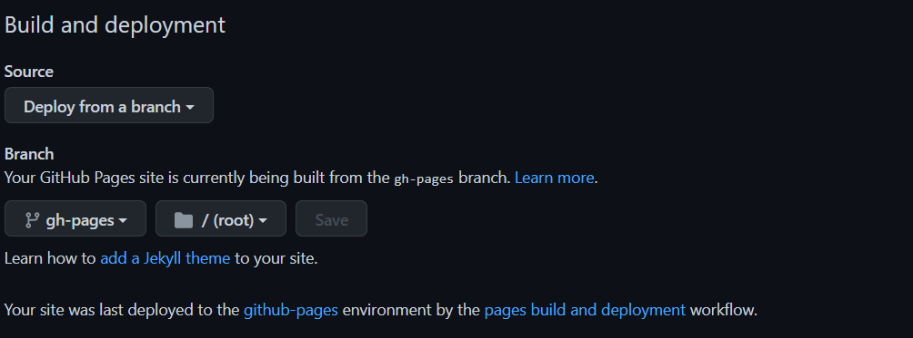

# My Dev Forum,
Think of any forum website, but stripped down to the bare minimum. Everything like solutions, gifs, emojis and embedded files/videos are all gone. Just sending messages back and forth using **Firebase.**
Here is How To Use It

## How Do I Use It?
### Acessing The Repo / Downloading
Clone or Download the GitHub repo from [**here**](https://github.com/ChezyName/DevFourm/archive/refs/heads/main.zip), Once you download it, open up the files and you'll see some nice things. A README.md, where this is located, but the most important part is that you have [NodeJS](https://nodejs.org/en/) and [NPM](https://docs.npmjs.com/downloading-and-installing-node-js-and-npm) downloaded. Once you open up the folder, open your terminal or CMD and run `npm install` or `npm i` that will install all of your necessary packages for the project to work.

### Editing Your Config / API KEYS
There **WAS** an `ENV.tsx` file in an early build of the project but had to be placed inside `.gitignore` because all the keys go in there. If there is no file named `ENV.tsx` inside `src/` then create one, and put the following code inside of it.
``` typescript
export  const  CONFIG = {
	apiKey:  "",
	authDomain:  "",
	projectId:  "",
	storageBucket:  "",
	messagingSenderId:  "",
	appId:  "",
	measurementId:  ""
};
```
> You can find this when creating a new Firebase Web Application

Just insert your keys inside or you can copy the code provided by  Firebase and put the keywords `export const CONFIG` before.

>Make sure you enable Firestore inside your Firebase application.

### Building & Deploying
Building your app is quite simple but can get messed up easily.
First, run `npm run build` for all your files to be built into the `dist/` folder. Once that runs, Just push your code to GitHub, and the code in `.github/workflows/deploy.yml` will run, It moves all the files in `dist/` into a separate branch to be deployed into GitHub Pages
> If you receive an error inside the action tab of GitHub, it might be because you do not have a branch named `gh-pages`. Just add a branched named that, and you'll be good to go.

Finally, in order to see your pages. go into the settings tab of your repository, On the left panel, click the pages button and under **Build and deployment** choose your source as your newly made branch and that's it.
> In order for GitHub & Vite to both build in sync, inside `vite.config.ts` change `base:  '/DevFourm/',` to your repo name, for example if your repo is named JACK it would be `base:  '/JACK/',`

#### Image Reference On What It Looks Like

